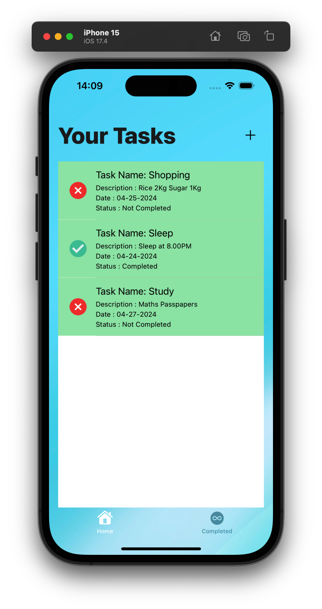
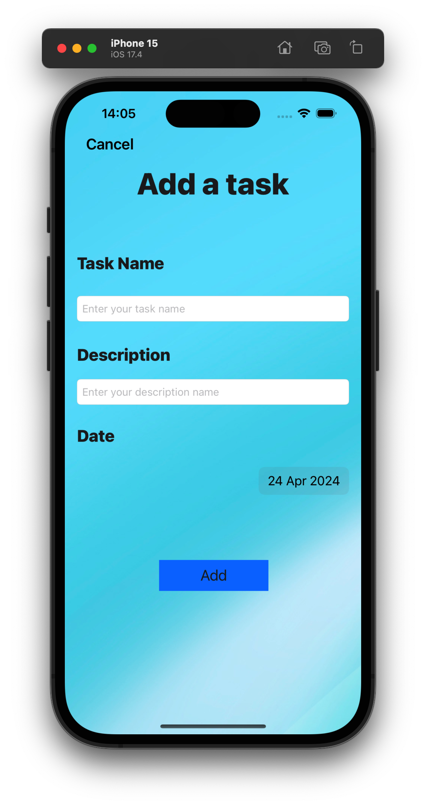
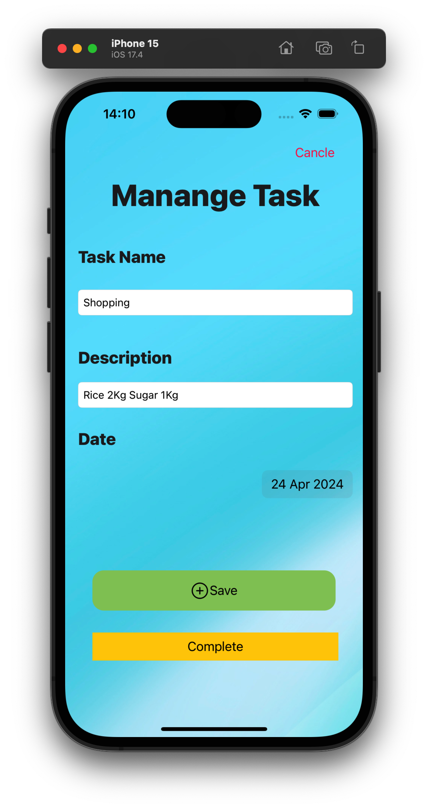
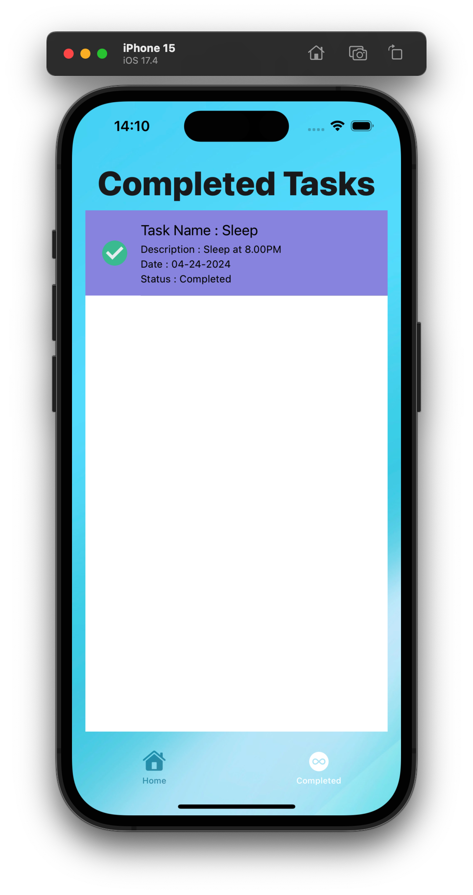
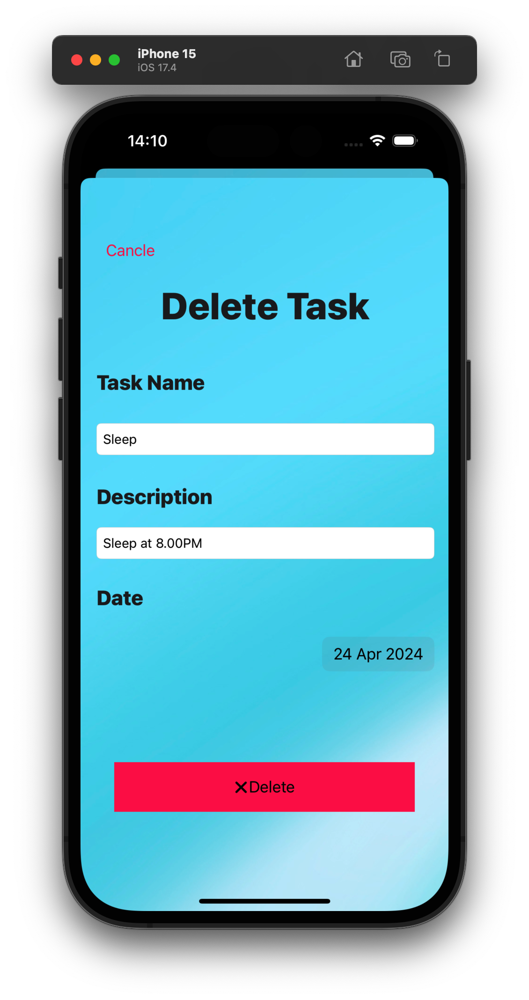

# Project Name - TaskMate

#### 01. Brief Description of Project - TaskMate is a to-do app that allows users to perform CRUD (Create, Read, Update, Delete) operations on their tasks. It is built using Firebase as the backend database and Swift UIKit for the iOS frontend.

#### 02. Users of the System - The users of TaskMate are individuals who want to organize their tasks efficiently. This app caters to a wide range of users, from students managing their assignments to professionals organizing their work tasks.

#### 03. What is unique about your solution - TaskMate stands out with its seamless integration of Firebase, allowing real-time synchronization of tasks across multiple devices. Its intuitive user interface and smooth user experience make task management easy and efficient.

#### 04. Briefly document the functionality of the screens

<h2>Task Page</h2>

  
  
This is home page. In this page User can check all the completed and not completed tasks. User can add new task by clicking plus button in the top of the page.

<h2>Add Task Page</h2>

  
  
In this page user can add new task by filling task name ,task description and date. 

<h2>Edit Task Page</h2>

  
  
In this page user can edit task by editing name, description and date. User can mark task as Completed in this page. If user edited completed task it will be automatically change state into Not completed 

<h2>Completed Task Page</h2>

  
  
In this page user can see all the completed tasks. User can view task details by clicking on it.

<h2>Delete Task Page</h2>

  
  
In this page user can delete task. If user want cancle activity they can click cancle button on top of the page.

#### 05. Give examples of best practices used when writing code

* Descriptive Naming: Use meaningful and descriptive names for variables, functions, classes, and other elements of your code. This enhances readability and makes the code self-explanatory.
* Consistent Formatting: Follow consistent formatting conventions throughout your codebase. This includes indentation, spacing, and line breaks. Consistent formatting improves readability and makes it easier to maintain the code.
* Modularization: Divide your code into smaller, modular components with well-defined responsibilities. This promotes reusability, maintainability, and testability.
* Documentation: Provide clear and concise documentation for your code, including comments, docstrings, and README files. Documentation helps other developers understand how to use your code and its purpose.
* Error Handling: Implement robust error handling to gracefully handle unexpected situations and failures. This includes using try-catch blocks, guard statements, and throwing custom errors where appropriate.
* Testing: Write unit tests and integration tests to verify the correctness and behavior of your code. Test-driven development (TDD) can help ensure that your code meets requirements and remains stable over time.
* Use of MVC Architecture with Firebase Integration: Continue organizing the code into Model-View-Controller architecture, but incorporate Firebase services into the model layer for database operations. For example, create separate FirebaseService classes to handle database interactions, keeping view controllers focused on presentation logic.
* Use of Clean Folder Structure: Maintain a clean folder structure.
* Firebase Realtime Database: Instead of Core Data, use Firebase Realtime Database or Firestore for persistent storage. Encapsulate Firebase database operations within dedicated service classes, such as DeckService and FlashcardsService, to abstract away implementation details from view controllers.
* Error Handling with Firebase APIs: Implement error handling mechanisms for Firebase operations, such as using Firebase SDK's completion handlers or Combine's publishers, to handle success and failure cases gracefully.

#### 06. UI Components used

* UINavigationController: Manages navigation between the main screen (list of tasks) and individual task views or editing screens.
* UITabBarController: Allows users to switch between different sections of the app, such as the main task list and completed tasks.
* UIViewController: Each screen is managed by its own UIViewController.
* UIButton: Used for navigation, actions, and interactions like adding new tasks and editing tasks during practice sessions.
* UITextField: Input fields for entering task titles, task description, and date.
* UITextView: Used for displaying longer text content like task descriptions or task date.
* UIAlertController: Used to confirm actions such as deleting a flashcard or deck, or to show errors/alerts when user input is needed or an operation fails.
* UIScrollView: Allows users to scroll through entire views, especially when content exceeds the screen size.
* UICollectionView: Displays a collection of tasks or tasks in a grid layout, allowing users to horizontally scroll through tasks.
* UITableView: Displays a list of tasks in a vertical layout.
* UIImageView: Displays images or icons.

#### 07. Testing carried out

Unit testing and UI testing were not formally conducted for this application. Instead, the app underwent manual testing using iOS simulators. This involved thorough examination of all features, such as creating and editing tasks, adding and modifying tasks, and navigating through the various UI components. Real-time interaction scenarios were explored to identify any issues and ensure alignment with expectations regarding functionality and user experience.

#### 08. Documentation 

(a) Design Choices

The development of the TaskMate app was influenced by several design considerations aimed at creating a seamless user experience and scalable architecture.

* Architecture: The app was structured using the Model-View-Controller (MVC) architectural pattern. This division of responsibilities ensures that the user interface, business logic, and data management are separate and organized, promoting code maintainability and reusability.

* Firebase Integration : Firebase was selected as the backend platform due to its real-time database capabilities and ease of integration with iOS applications. This choice facilitates real-time data synchronization and enables collaborative features such as shared task lists.

* User Interface : The focus was on designing an intuitive and visually appealing interface. Features such as real-time updates, notifications, and collaborative editing were prioritized to enhance user productivity. The UI design utilized a combination of Storyboards and programmatically created elements to achieve responsiveness across various device sizes.

* Custom Components : Third-party libraries were avoided to maintain a lightweight app. Custom UI components were developed to ensure consistency and coherence in the user interface.

(b) Implementation Decisions

The implementation of the TaskMate app involved several key decisions to effectively integrate Firebase and ensure a smooth user experience.

* Data Management : Firebase Realtime Database was employed for managing tasks, providing real-time synchronization and offline support. Model classes were created to encapsulate data structures and interactions with Firebase, maintaining separation between data handling and presentation layers.

* Real-Time Updates : Firebase's real-time synchronization capabilities were leveraged to enable instant updates to tasks across devices. Observers and listeners were implemented to detect and handle changes to data in real-time.

* Error Handling : Robust error handling mechanisms were implemented to gracefully manage network errors, authentication failures, and other potential issues when interacting with Firebase services.

(c) Challenges

The development of the TaskMate app presented several challenges:

* Learning Curve : Adopting Firebase and mastering its real-time synchronization features required a learning curve, necessitating thorough experimentation and documentation review.

* Firebase Security Rules : Configuring Firebase Security Rules to ensure data security while maintaining usability was challenging and required careful consideration and testing.

* Handling Real-Time Updates : Managing real-time updates and resolving conflicts across devices posed challenges, particularly in scenarios with high concurrency.

* Firebase Performance Optimization : Optimizing Firebase performance, especially with large datasets, required careful consideration of data structure, indexing, and caching strategies.

#### 09. Reflection

The development of the TaskMate app was a valuable learning experience that showcased the power of Firebase for real-time data synchronization in iOS applications. Despite the challenges encountered, the end result was a feature-rich and robust application that met the project objectives. Moving forward, continued exploration of Firebase's capabilities and best practices will be crucial for tackling more complex projects and delivering exceptional user experiences.

Challenges that you faced in doing the assingment (other than know technical issues of getting hold of a proper Mac machine).
How would have approached this Assignment differently

  

